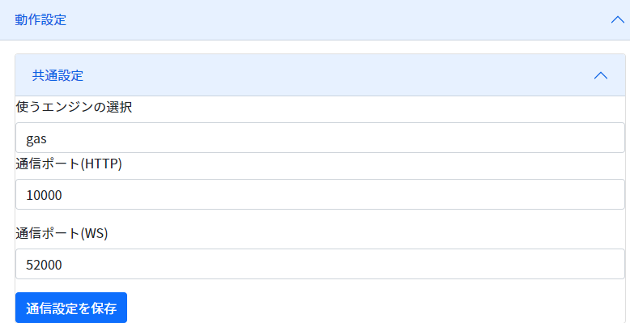
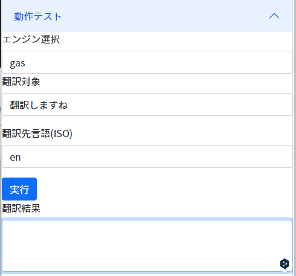
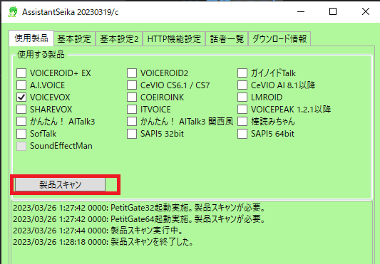
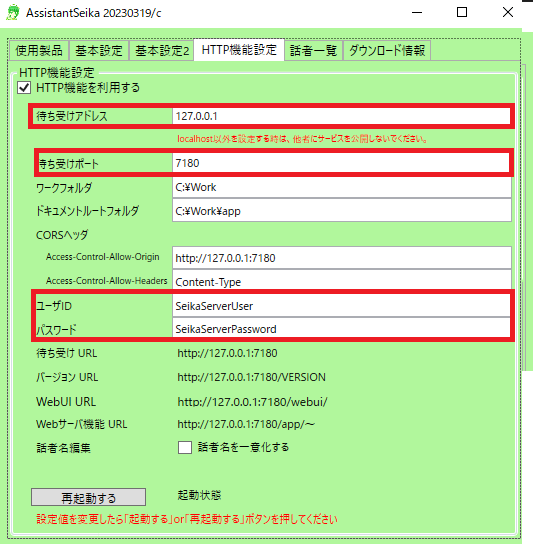
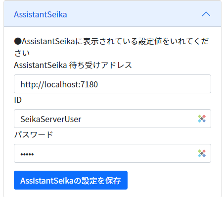

# エンジンの設定

## 共通

### 共通設定

* デフォルトで使うエンジン設定をします。
* 通信ポート(HTTP)は、わんコメやクライアントで通信するためのポートを指定します。
* 通信ポート(WS)は、わんコメやクライアントで通信するためのWebSocketポートを指定します。

## 翻訳

### キー設定

* 翻訳キー設定をします。
* 各サイトで取得した設定値をいれます。

### 翻訳のテスト

* 翻訳キー設定をします。
* 各サイトで取得した設定値をいれます。

## 読み上げ

### 読み上げ設定

* 読み上げには[AssistantSeika](https://hgotoh.jp/wiki/doku.php/documents/voiceroid/assistantseika/assistantseika-001a?redirect=1)を活用します。あらかじめインストールしてください。
* インストールが終わったら、使いたい読み上げ音源ソフトにチェックを入れてスキャンをしましょう。

!!! Info "暫くフリーズします"
    * スキャン中は、AssistantSeikaが暫くフリーズします。
    * フリーズ中にタブ操作などをすると上手く動かないので、操作しないようにしてください。

* AssistantSeikaの設定画面をみて、トランスルーに設定値をいれます。

