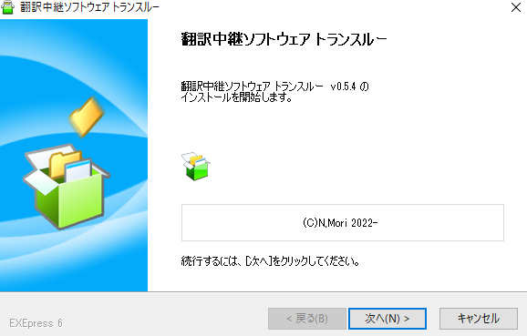
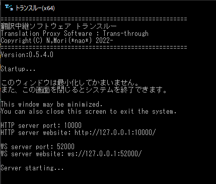

# インストール

* サイトからダウンロードしたプログラムを開きます。

* インストールがおわるとスタートメニューに項目が増えます。使う方のメニューを起動してください。

|種類|                             |
|-----|----------------------------|
|x64  |Intel版Windows             |
|ARM64|ARM版Windows                |

!!! Info "起動しない場合について"

    * .Net7ランタイムが必要です。ランタイムを導入してください。

|種類| ランタイム                  |
|-----|----------------------------|
|x64  |[ダウンロード](https://dotnet.microsoft.com/ja-jp/download/dotnet/thank-you/runtime-aspnetcore-7.0.4-windows-x64-binaries)            |
|ARM64|[ダウンロード](https://dotnet.microsoft.com/ja-jp/download/dotnet/thank-you/runtime-aspnetcore-7.0.4-windows-arm64-binaries)                |

* 起動すると黒い画面がでます。
* この画面を閉じるとプログラムは終了します。
* 使用している間は最小化し、起動したままにしてください。

