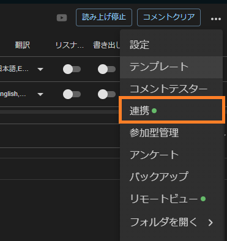
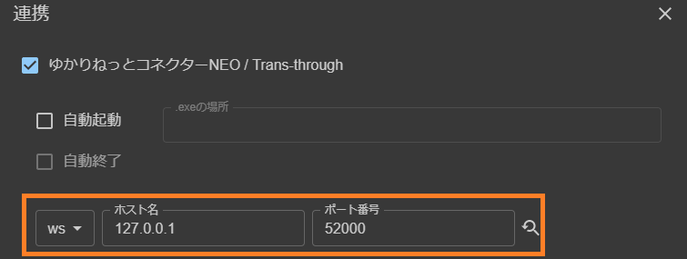
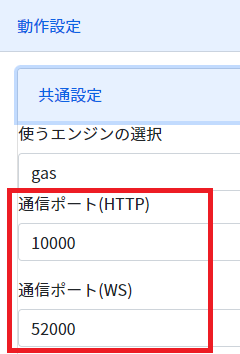
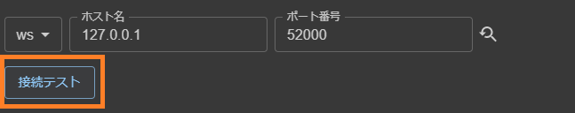
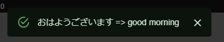
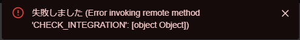
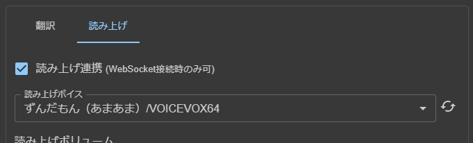

# わんコメ向け設定

* 設定をすることでわんコメと連携ができます。

## 1. わんコメの設定画面をだす

## 2. 通信設定を合わせる

* 通信ポートのホスト名は `127.0.0.1` となります。
* 多言語翻訳や読み上げの機能を使う場合は `WS` を選択します。
* 一般的には、`WS` の方が、応答が速いです。

## 3. 通信テストをする

* 接続テストをします。

* うまく設定ができていれば、緑色の画面がでます

* 通信ができない場合は、赤色の画面が出ます

!!! info "通信ができない場合があります"
    * 設定があっていても、何かしらの理由で通信が拒否されることがあります。
    * なんどかテストを押して様子を見てみてください。

## 4. 読み上げ設定をする

* AssistantSeikaを使っている場合は、この項目でリロードすることで、表示されます。

!!! info "リスト更新ができない場合があります"
    * AssistantSeikaのHTTP機能が起動しているか確認しましょう
    * AssistantSeikaが音源を認識しているか確認しましょう
